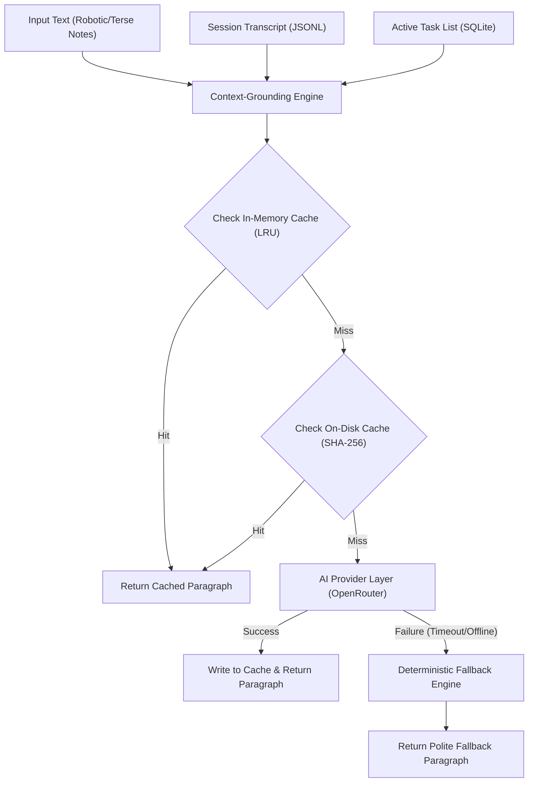

# Swiz — Humanisation System

The Humanisation System in Swiz converts terse, machine-generated coding-agent steering notes, system warnings, or environment status logs into single, cohesive paragraphs of polite, natural, and direct coworker-like instruction. 

By stripping robotic bureaucracy and injecting real-time session context, the humanisation layer ensures that instructions feel continuous, collaborative, and grounded in the ongoing progress of the developer.

---

## Core Architecture

When a note is humanised via `humaniseText()` in `src/utils/humanise.ts`, the text undergoes context enrichment, dual-layer cache evaluation, and LLM-driven rewriting with an immediate deterministic fallback if the model is unreachable.



---

## Context-Grounding Engine

To prevent the rewritten instruction from feeling disjointed, the Humanisation System reads and injects the developer's immediate context before sending the prompt to the AI provider. This grounding allows rewritten messages to naturally flow and develop from ongoing progress.

### 1. Related Conversation Context
- **Source**: Session transcript (JSONL format, resolved via `getLastTranscriptMessage()`).
- **Logic**: Scans backward through transcript entries to extract the last valid, non-empty `user` or `assistant` message.
- **Exclusions**: Completely ignores internal system feedback or automated command logs (such as `"Stop hook feedback:"` or `<command-message>`).
- **Format**:
  ```
  Related Conversation Context (Last Message):
  [User/Assistant]: <last message text>
  ```

### 2. Active In-Progress Tasks
- **Source**: SQLite task store (resolved via `getInProgressTasksSnippet()`).
- **Logic**: Retrieves all active session tasks with `status === "in_progress"`.
- **Format**:
  ```
  Active In-Progress Tasks:
  - #<taskId>: <subject>
  ```

---

## Tone & Style Rules

The system utilizes modular prompt segments to enforce strict stylistic constraints. The final text must adopt a professional, collaborative, and dead-pan coworker-like tone.

### 1. Collaborative & Spoken-Word Cadence
- **Manners**: Must always include `"please"` when making requests, and always close with `"thanks"` or `"thank you"`.
- **Collaborative Framing**: Uses collaborative `"we"` and `"let's"` framing instead of commanding `"you"` instructions (e.g., *"Nice, all the tests passed! Let's go ahead and push..."*).
- **Spoken Cadence**: Always uses natural contractions (e.g., `"don't"`, `"haven't"`, `"let's"`, `"it's"`). Completely bans formal transitions (e.g., *"subsequently"*, *"therefore"*, *"consequently"*, *"initially"*), connecting ideas naturally with `"and"`, `"but"`, `"so"`, or `"then"`.

### 2. Strict Exaggeration & Drama Ban
To ensure the output remains professional and avoids fatigue, the prompt bans and excludes hyperbolic, dramatic, or theatrical expressions:
- **Banned Words**: `"obsessed with"`, `"honestly"`, `"genuinely"`, `"vibrating"`, `"mind-blowing"`, `"literally crying/shaking"`, `"epic"`, `"I'm impressed"`, `"pretty impressive"`.
- **Banned Tropes**: References to world-ending/universe-collapsing events (e.g., `"before the world ends"`, `"before the universe collapses"`, `"lose our minds"`), and sarcastic or hyperactive developer comments about boredom or headaches.

### 3. Contextual Emotional Trigger Modes
Weave in realistic human emotion by identifying the correct emotional trigger mode for the context:

| Mode | Trigger Condition | Example Tone |
|---|---|---|
| **DEAD-PAN/CALM** | Input has error messages, failures, dirty states, cache/conflict cleanups, or outstanding fixes. | Expresses dry, calm, or dead-pan focus. Uses trailing ellipses (`...`) for pauses (e.g., *"Looks like the tests didn't pass, let's fix it..."*). |
| **SATISFACTION** | Input has passing tests, successful builds, clean status reports, or finished tasks. | Calm, understated satisfaction (e.g., *"Nice, all the tests passed! Let's push this, please. Thank you."*). |
| **STANDARD FLOW** | Standard sequential coding steps, editing files, or normal progress. | Relaxed, collaborative developer voice with softeners like *"let's go ahead and"*, *"real quick"*, or *"just need to"*. |

### 4. Stripping System Bureaucracy
All internal system constraints, safety/audit gates, task-tracking mechanics, and file/memory limits are completely stripped or translated into human prose:
- Instead of `"task creation tool"` / `"task buffer"`, say *"check the task list to see what's next"* or *"pick up the pending work"*.
- Instead of `"trunk mode"` / `"direct push workflow"`, say *"push the changes"* or *"get everything onto main"*.
- Instead of `"dirty file limits"`, say *"keep our workspace clean"*.
- Completely ignore all mentions of memory thresholds, token constraints, and age gates.

---

## Dual-Layer Cache System

To minimize network latencies, lower API token consumption, and ensure high responsiveness, the Humanisation System employs a robust, two-tiered caching mechanism.

### Tier 1: In-Memory LRU Cache
- **Implementation**: Utilizes an `lru-cache` instance (`HUMANISE_CACHE`).
- **Capacity**: Caps at 250 entries.
- **TTL**: 10 minutes (`10 * 60 * 1000` ms).
- **Key Generation**: Unique composite string of:
  `{trimmed_input}::{system_prompt}::{resolved_context_snippet}`

### Tier 2: On-Disk Persistent Cache
- **Location**: Default is `~/.swiz/prompt-cache` (customizable via `SWIZ_PROMPT_CACHE_DIR` env override).
- **Key Generation**: Filename is a SHA-256 hex digest of the full combined prompt.
- **Self-Cleaning / Pruning**: On every cache write, the system asynchronously prunes old files:
  - Evicts files older than 30 days (`PROMPT_CACHE_MAX_AGE_MS`).
  - Caps the total number of files at 500 (`PROMPT_CACHE_MAX_ENTRIES`).
  - Keeps the youngest files based on `mtime` if the cap is exceeded.
  - Fail-safe: All read/write/pruning operations ignore and catch file I/O errors so the core humanisation flow is never blocked.

---

## Deterministic Fallback Engine

If the AI provider is offline, rate-limited, or fails to respond within the timeout limit (default `8,000ms`), the system instantly falls back to a deterministic, local rewriting algorithm (`fallbackHumaniseText`).

### Fallback Processing Pipeline
1. **Paragraph Flattening**: Collapses multi-line, machine-readable items and strips leading markdown/list formatting (e.g., `-`, `*`, `1.`, `[ ]`, `[x]`) into a clean, single-line text using `toSingleParagraph()`.
2. **Imperative Verb Conversion**: Maps leading uppercase imperative verbs to lowercase (e.g., `"Continue"`, `"Take"`, `"Fix"`, `"Add"`, `"Update"`, `"Commit"`, `"Push"`, `"Run"`, `"Resolve"`, `"Use"`, `"Complete"` are lowercase).
3. **Politeness Wrapping**: Wraps the converted instruction with collaborative prefixes and polite closures.
   - *Example Input*: `"- Fix compiler warning in src/cli.ts. - Commit the changes."`
   - *Example Fallback Output*: `"I noticed you haven't done this yet — please fix compiler warning in src/cli.ts and commit the changes, thanks."`

---

## Key Modules & Files

- [src/utils/humanise.ts](file:///Users/matthewherod/Development/swiz/src/utils/humanise.ts) — Humanisation core engine, prompts, and cache management.
- [src/utils/humanise.test.ts](file:///Users/matthewherod/Development/swiz/src/utils/humanise.test.ts) — Unit tests covering caching, pruning, context injection, and fallback mechanics.
- [src/tasks/task-recovery.ts](file:///Users/matthewherod/Development/swiz/src/tasks/task-recovery.ts) — Handles retrieving active tasks from the session state.
- [src/utils/transcript.ts](file:///Users/matthewherod/Development/swiz/src/utils/transcript.ts) — Handles transcript file operations.
